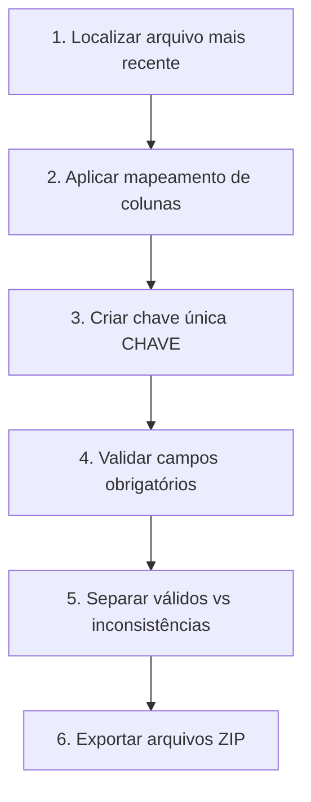
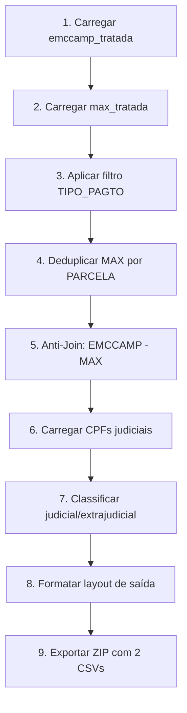
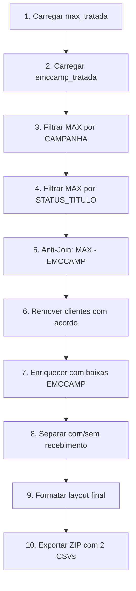
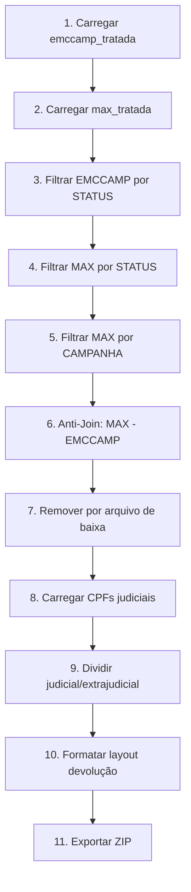

# 📋 GUIA COMPLETO: PROCESSO EMCCAMP

**Objetivo:** Documentar com riqueza de detalhes todo o processo realizado no sistema EMCCAMP, permitindo replicação exata com chance zero de erro.

---

## 🎯 VISÃO GERAL

O Sistema EMCCAMP é uma pipeline de processamento de dados financeiros que realiza **6 etapas sequenciais**:


| Etapa | Objetivo | Resultado |
|-------|----------|-----------|
| 1. Extração | Coletar dados de APIs e bancos | Arquivos ZIP em `data/input/` |
| 2. Tratamento | Normalizar e validar EMCCAMP/MAX | Bases tratadas + inconsistências |
| 3. Batimento | Identificar títulos EMCCAMP ausentes na MAX | `emccamp_batimento_*.zip` |
| 4. Baixas | Filtrar títulos MAX não reportados | `emccamp_baixa_*.zip` |
| 5. Devolução | Gerar arquivo para devolução MAX−EMCCAMP | `emccamp_devolucao_*.zip` |
| 6. Enriquecimento | Consolidar contatos para discagens | `enriquecimento_contato_emccamp.zip` |

---

## 📂 ESTRUTURA DE ARQUIVOS

### Diretórios de Entrada (`data/input/`)
```
data/input/
├── emccamp/                    # Dados EMCCAMP (API TOTVS)
│   └── Emccamp.zip             # Base principal EMCCAMP
├── base_max/                   # Dados MAX (SQL Server)
│   └── MaxSmart.zip            # Base de cobrança MAX
├── judicial/                   # Dados judiciais (AutoJur)
│   └── ClientesJudiciais.zip   # CPFs em processo judicial
├── baixas/                     # Baixas EMCCAMP (API TOTVS)
│   └── baixa_emccamp.zip       # Registros de pagamentos
└── doublecheck_acordo/         # Acordos (MaxSmart)
    └── acordos_abertos.zip     # Clientes com acordo ativo
```

### Diretórios de Saída (`data/output/`)
```
data/output/
├── emccamp_tratada/            # Base EMCCAMP tratada
│   └── emccamp_tratada_YYYYMMDD_HHMMSS.zip
├── max_tratada/                # Base MAX tratada
│   └── max_tratada_YYYYMMDD_HHMMSS.zip
├── inconsistencias/            # Registros inconsistentes
│   ├── emccamp_inconsistencias_*.zip
│   └── max_inconsistencias_*.zip
├── batimento/                  # Resultado do batimento
│   └── emccamp_batimento_*.zip
│       ├── emccamp_batimento_judicial_*.csv
│       └── emccamp_batimento_extrajudicial_*.csv
├── baixa/                      # Resultado das baixas
│   └── emccamp_baixa_*.zip
│       ├── baixa_com_recebimento_*.csv
│       └── baixa_sem_recebimento_*.csv
├── devolucao/                  # Resultado da devolução
│   └── emccamp_devolucao_*.zip
└── enriquecimento_contato_emccamp/
    └── enriquecimento_contato_emccamp.zip
```

---

## 📥 ETAPA 1: EXTRAÇÃO DE DADOS

### 1.1 Extração EMCCAMP (API TOTVS)

**Arquivo:** `src/scripts/extrair_emccamp.py`  
**Comando:** `python main.py extract emccamp`

#### Fonte de Dados
| Item | Valor |
|------|-------|
| **Origem** | API TOTVS (endpoint CANDIOTTO.001) |
| **Autenticação** | HTTP Basic Auth |
| **Formato** | JSON → CSV |
| **Destino** | `data/input/emccamp/Emccamp.zip` |

#### Configuração via `.env`
```properties
EMCCAMP_API_URL=https://url-api-totvs/endpoint
EMCCAMP_API_USER=usuario
EMCCAMP_API_PASSWORD=senha
EMCCAMP_DATA_VENCIMENTO_INICIAL=2020-01-01
EMCCAMP_DATA_VENCIMENTO_FINAL=AUTO  # AUTO = hoje - 6 dias
```

#### Campos Extraídos da API
| Campo API | Descrição |
|-----------|-----------|
| `CODCOLIGADA` | Código da coligada |
| `NOME_COLIGADA` | Nome da coligada |
| `CLIENTE` | Nome do cliente |
| `CPF` | CPF/CNPJ do cliente |
| `NUM_VENDA` | Número do contrato |
| `PARCELA` | Número da parcela |
| `ID_PARCELA` | ID único da parcela |
| `VENCIMENTO` | Data de vencimento |
| `VALOR_ORIGINAL` | Valor original da parcela |
| `VALOR_ATUALIZADO` | Valor atualizado |
| `TIPO_PAGTO` | Tipo de pagamento |
| `NOME_EMPREENDIMENTO` | Nome do empreendimento |
| `CNPJ_EMPREENDIMENTO` | CNPJ do empreendimento |
| `CNPJ_CREDOR` | CNPJ do credor |
| `OBSERVACAO_PARCELA` | Observações |
| `ID_NEGOCIADOR` | ID do negociador |

---

### 1.2 Extração MAX (Banco SQL Server)

**Arquivo:** `src/scripts/extrair_basemax.py`  
**Comando:** `python main.py extract max`

#### Fonte de Dados
| Item | Valor |
|------|-------|
| **Origem** | SQL Server (STD2016) |
| **Parâmetro** | `mo_cliente_id: 77398` |
| **Filtros** | Data de vencimento (variáveis de ambiente) |
| **Destino** | `data/input/base_max/MaxSmart.zip` |

#### Configuração via `.env`
```properties
SQL_SERVER_HOST=servidor
SQL_SERVER_DATABASE=banco
SQL_SERVER_USER=usuario
SQL_SERVER_PASSWORD=senha
MAX_DATA_VENCIMENTO_INICIAL=2020-01-01
MAX_DATA_VENCIMENTO_FINAL=2025-12-31
```

#### Campos Extraídos do Banco
| Campo | Descrição |
|-------|-----------|
| `CAMPANHA` | Código da campanha (ex: "000041 - EMCCAMP") |
| `CREDOR` | Nome do credor |
| `CNPJ_CREDOR` | CNPJ do credor |
| `CPFCNPJ_CLIENTE` | CPF/CNPJ do cliente |
| `NOME_RAZAO_SOCIAL` | Nome/Razão social |
| `NUMERO_CONTRATO` | Número do contrato |
| `EMPREENDIMENTO` | Nome do empreendimento |
| `DATA_CADASTRO` | Data de cadastro |
| `PARCELA` | ID da parcela (formato: CONTRATO-NUMERO) |
| `Movimentacoes_ID` | ID da movimentação |
| `VENCIMENTO` | Data de vencimento |
| `VALOR` | Valor da parcela |
| `STATUS_TITULO` | Status do título (ABERTO, PAGO, etc.) |
| `TIPO_PARCELA` | Tipo da parcela |
| `DT_BAIXA` | Data da baixa (se houver) |
| `RECEBIDO` | Valor recebido (se houver) |

---

### 1.3 Extração de Baixas EMCCAMP

**Arquivo:** `src/scripts/extrair_baixa_emccamp.py`  
**Comando:** `python main.py extract baixa`

#### Fonte de Dados
| Item | Valor |
|------|-------|
| **Origem** | API TOTVS (endpoint CANDIOTTO.002) |
| **Filtro** | `HONORARIO_BAIXADO != 0` |
| **Destino** | `data/input/baixas/baixa_emccamp.zip` |

#### Processamento Aplicado
1. Filtra registros onde `HONORARIO_BAIXADO != 0`
2. Cria coluna `CHAVE = NUM_VENDA + "-" + ID_PARCELA`
3. Normaliza `DATA_RECEBIMENTO` para formato `YYYY-MM-DD`
4. Converte `VALOR_RECEBIDO` para numérico

---

### 1.4 Extração de Dados Judiciais

**Arquivo:** `src/scripts/extrair_judicial.py`  
**Comando:** `python main.py extract judicial`

| Item | Valor |
|------|-------|
| **Origem** | SQL Server (AutoJUR + MAX Smart) |
| **Parâmetro** | `grupo_empresarial: EMCCAMP` |
| **Destino** | `data/input/judicial/ClientesJudiciais.zip` |

---

### 1.5 Extração de Acordos

**Arquivo:** `src/scripts/extrair_doublecheck_acordo.py`  
**Comando:** `python main.py extract doublecheck`

| Item | Valor |
|------|-------|
| **Origem** | SQL Server (MaxSmart) |
| **Parâmetro** | `campanhas_id: 4` |
| **Destino** | `data/input/doublecheck_acordo/acordos_abertos.zip` |

---

## 🔧 ETAPA 2: TRATAMENTO DE DADOS

### 2.1 Tratamento EMCCAMP

**Arquivo:** `src/processors/emccamp.py`  
**Classe:** `EmccampProcessor`  
**Comando:** `python main.py treat emccamp`

#### Fluxo de Processamento



#### 2.1.1 Mapeamento de Colunas

| Campo Original | Campo Normalizado | Descrição |
|----------------|-------------------|-----------|
| `CODCOLIGADA` | `COD_COLIGADA` | Código da coligada |
| `NOME_COLIGADA` | `NOME_COLIGADA` | Nome da coligada |
| `CLIENTE` | `NOME_RAZAO_SOCIAL` | Nome do cliente |
| `CPF` | `CPF_CNPJ` | CPF/CNPJ do cliente |
| `NUM_VENDA` | `CONTRATO` | Número do contrato |
| `PARCELA` | `N_PARCELA` | Número da parcela |
| `ID_PARCELA` | `PARCELA` | ID da parcela |
| `VENCIMENTO` | `DATA_VENCIMENTO` | Data de vencimento |
| `VALOR_ORIGINAL` | `VALOR_PARCELA` | Valor original |
| `VALOR_ATUALIZADO` | `VALOR_ATUALIZADO` | Valor atualizado |
| `TIPO_PAGTO` | `TIPO_PAGTO` | Tipo de pagamento |
| `NOME_EMPREENDIMENTO` | `NOME_EMPREENDIMENTO` | Nome do empreendimento |
| `CNPJ_EMPREENDIMENTO` | `CNPJ_EMPREENDIMENTO` | CNPJ do empreendimento |
| `CNPJ_CREDOR` | `CNPJ_CREDOR` | CNPJ do credor |
| `OBSERVACAO_PARCELA` | `OBSERVACAO_PARCELA` | Observações |
| `ID_NEGOCIADOR` | `ID_NEGOCIADOR` | ID do negociador |

#### 2.1.2 Criação de Chave Única

```python
# Fórmula da chave:
CHAVE = CONTRATO + "-" + PARCELA

# Exemplo:
# CONTRATO = "12345", PARCELA = "001"
# CHAVE = "12345-001"
```

#### 2.1.3 Validação de Dados

**Campos Obrigatórios:**
- `CONTRATO`
- `PARCELA`
- `DATA_VENCIMENTO`
- `VALOR_PARCELA`
- `CPF_CNPJ`

**Regras de Validação:**
1. ❌ Registro com `CHAVE` vazia → **Inconsistência**
2. ❌ Registro com `CHAVE` duplicada → **Inconsistência**
3. ❌ Registro com `CPF_CNPJ` vazio → **Inconsistência**

#### 2.1.4 Arquivos de Saída

| Arquivo | Conteúdo |
|---------|----------|
| `emccamp_tratada_YYYYMMDD_HHMMSS.zip` | Registros válidos |
| `emccamp_inconsistencias_YYYYMMDD_HHMMSS.zip` | Registros com problemas |

---

### 2.2 Tratamento MAX

**Arquivo:** `src/processors/max.py`  
**Classe:** `MaxProcessor`  
**Comando:** `python main.py treat max`

#### 2.2.1 Mapeamento de Colunas

| Campo Original | Campo Normalizado |
|----------------|-------------------|
| `CAMPANHA` | `CAMPANHA` |
| `CREDOR` | `CREDOR` |
| `CNPJ_CREDOR` | `CNPJ_CREDOR` |
| `CPFCNPJ_CLIENTE` | `CPF_CNPJ` |
| `NOME_RAZAO_SOCIAL` | `NOME_RAZAO_SOCIAL` |
| `NUMERO_CONTRATO` | `NUMERO_CONTRATO` |
| `EMPREENDIMENTO` | `EMPREENDIMENTO` |
| `DATA_CADASTRO` | `DATA_CADASTRO` |
| `PARCELA` | `PARCELA` |
| `Movimentacoes_ID` | `MOVIMENTACOES_ID` |
| `VENCIMENTO` | `DATA_VENCIMENTO` |
| `VALOR` | `VALOR` |
| `STATUS_TITULO` | `STATUS_TITULO` |
| `TIPO_PARCELA` | `TIPO_PARCELA` |

**Campos Preservados:** `DT_BAIXA`, `RECEBIDO`

#### 2.2.2 Criação de Chave

```yaml
# Configuração (config.yaml):
key:
  use_parcela_as_chave: true  # Usa PARCELA diretamente como CHAVE
```

```python
# A chave é o próprio campo PARCELA
CHAVE = PARCELA  # Ex: "12345-01"
```

#### 2.2.3 Validação Rigorosa

**Regex de Validação:**
```regex
^[0-9]{3,}-[0-9]{2,}$
```

**Exemplos:**
| Valor | Válido? | Motivo |
|-------|---------|--------|
| `12345-01` | ✅ | Formato correto |
| `123-12` | ✅ | Formato correto |
| `1234-001` | ✅ | Formato correto |
| `JM-3` | ❌ | Letras não permitidas |
| `123-1` | ❌ | Parte final precisa ter 2+ dígitos |
| `123` | ❌ | Falta hífen e segunda parte |
| `12/34` | ❌ | Barra não permitida |

**Regras de Validação:**
1. ❌ `PARCELA` vazia → **Inconsistência**
2. ❌ `PARCELA` não segue regex → **Inconsistência**
3. ❌ `PARCELA` duplicada → **Inconsistência**
4. ❌ `CHAVE` vazia ou duplicada → **Inconsistência**

#### 2.2.4 Arquivos de Saída

| Arquivo | Conteúdo |
|---------|----------|
| `max_tratada_YYYYMMDD_HHMMSS.zip` | Registros válidos |
| `max_inconsistencias_YYYYMMDD_HHMMSS.zip` | Registros com problemas |

---

## ⚖️ ETAPA 3: BATIMENTO EMCCAMP x MAX

**Arquivo:** `src/processors/batimento.py`  
**Classe:** `BatimentoProcessor`  
**Comando:** `python main.py batimento`

### Objetivo
Identificar registros presentes na base EMCCAMP mas **AUSENTES** na base MAX.

> **Fórmula:** `EMCCAMP - MAX` (Anti-Join)

### Fluxo de Processamento



### 3.1 Filtros Aplicados

**Configuração (config.yaml):**
```yaml
flags:
  filtros_batimento:
    habilitar: true
    tipos_excluir:
      - PERMUTA
      - Financiamento Fixo
```

> **Efeito:** Remove registros EMCCAMP onde `TIPO_PAGTO` é "PERMUTA" ou "Financiamento Fixo" **antes** do batimento.

### 3.2 Operação Anti-Join

```python
# Arquivo: src/utils/anti_join.py
def procv_emccamp_menos_max(df_emccamp, df_max, col_emccamp="CHAVE", col_max="CHAVE"):
    """
    Retorna registros EMCCAMP que NÃO existem em MAX (EMCCAMP - MAX).
    Usado para batimento: títulos do credor ausentes no sistema de cobrança.
    """
    right_keys = set(df_max[col_max].astype(str).str.strip().dropna())
    mask = ~df_emccamp[col_emccamp].astype(str).str.strip().isin(right_keys)
    return df_emccamp[mask].copy()
```

### 3.3 Classificação Judicial/Extrajudicial

1. Carrega arquivo `ClientesJudiciais.zip`
2. Extrai conjunto de CPFs normalizados (apenas dígitos)
3. Para cada registro do batimento:
   - Se CPF está na lista judicial → **Judicial**
   - Se CPF não está na lista → **Extrajudicial**

### 3.4 Layout de Saída

| Coluna | Origem |
|--------|--------|
| `CPFCNPJ CLIENTE` | `CPF_CNPJ` ou `CPFCNPJ_CLIENTE` |
| `NOME / RAZAO SOCIAL` | `NOME_RAZAO_SOCIAL` ou `CLIENTE` |
| `NUMERO CONTRATO` | `CONTRATO` ou `NUMERO_CONTRATO` |
| `PARCELA` | `CHAVE` |
| `OBSERVACAO PARCELA` | `PARCELA` |
| `VENCIMENTO` | `DATA_VENCIMENTO` |
| `VALOR` | `VALOR_PARCELA` ou `VALOR` |
| `EMPREENDIMENTO` | `NOME_EMPREENDIMENTO` |
| `CNPJ EMPREENDIMENTO` | `CNPJ_EMPREENDIMENTO` |
| `TIPO PARCELA` | `TIPO_PAGTO` (maiúsculas) |
| `CNPJ CREDOR` | Valor fixo: `19.403.252/0001-90` |

### 3.5 Arquivos de Saída

```
emccamp_batimento_YYYYMMDD_HHMMSS.zip
├── emccamp_batimento_judicial_YYYYMMDD_HHMMSS.csv
└── emccamp_batimento_extrajudicial_YYYYMMDD_HHMMSS.csv
```

---

## 📉 ETAPA 4: BAIXAS MAX - EMCCAMP

**Arquivo:** `src/processors/baixa.py`  
**Função:** `executar_baixa()`  
**Comando:** `python main.py baixa`

### Objetivo
Identificar registros presentes na base MAX mas **AUSENTES** na base EMCCAMP para reconciliação.

> **Fórmula:** `MAX - EMCCAMP` (Anti-Join)

### Fluxo de Processamento



### 4.1 Filtros Aplicados na Base MAX

**Configuração (config.yaml):**
```yaml
baixa:
  filtros:
    max:
      campanhas:
        - '000041 - EMCCAMP'
        - '000041-EMCCAMP'
        - 'EMCCAMP 41'
      status_titulo:
        - ABERTO
```

> **Efeito:** Mantém apenas registros MAX da campanha EMCCAMP com status ABERTO.

### 4.2 Operação Anti-Join

```python
# Arquivo: src/utils/anti_join.py
def procv_max_menos_emccamp(df_max, df_emccamp, col_max="PARCELA", col_emccamp="CHAVE"):
    """
    Retorna registros MAX que NÃO existem em EMCCAMP (MAX - EMCCAMP).
    Usado para gerar arquivo de devolução.
    """
```

**Chaves utilizadas:**
```yaml
baixa:
  chaves:
    emccamp: CHAVE    # "12345-001"
    max: PARCELA      # "12345-01"
```

### 4.3 Filtro de Acordos

1. Carrega arquivo `acordos_abertos.zip`
2. Extrai CPFs de clientes com acordo ativo
3. Remove registros cujo CPF está na lista de acordos

### 4.4 Enriquecimento com Baixas

1. Carrega arquivo `baixa_emccamp.zip`
2. Faz merge pela `CHAVE`
3. Preenche `DATA_RECEBIMENTO` e `VALOR_RECEBIDO`

### 4.5 Separação por Recebimento

| Condição | Arquivo |
|----------|---------|
| `DATA_RECEBIMENTO` e `VALOR_RECEBIDO` preenchidos | `baixa_com_recebimento_*.csv` |
| Campos vazios | `baixa_sem_recebimento_*.csv` |

### 4.6 Layout de Saída

| Coluna | Origem |
|--------|--------|
| `CNPJ CREDOR` | `CNPJ_CREDOR` ou config |
| `CPF/CNPJ CLIENTE` | `CPF_CNPJ` |
| `NOME CLIENTE` | `NOME_RAZAO_SOCIAL` |
| `NUMERO DOC` | `CHAVE` |
| `DT. VENCIMENTO` | `DATA_VENCIMENTO` (formato DD/MM/AAAA) |
| `VALOR DA PARCELA` | `VALOR` |
| `STATUS ACORDO` | Valor fixo: `2` |
| `DT. PAGAMENTO` | `DATA_RECEBIMENTO` (formato DD/MM/AAAA) |
| `VALOR RECEBIDO` | `VALOR_RECEBIDO` |

### 4.7 Arquivos de Saída

```
emccamp_baixa_YYYYMMDD_HHMMSS.zip
├── baixa_com_recebimento_YYYYMMDD_HHMMSS.csv
└── baixa_sem_recebimento_YYYYMMDD_HHMMSS.csv
```

---

## 🔁 ETAPA 5: DEVOLUÇÃO MAX - EMCCAMP

**Arquivo:** `src/processors/devolucao.py`  
**Classe:** `DevolucaoProcessor`  
**Comando:** `python main.py devolucao`

### Objetivo
Gerar arquivo de devolução: títulos presentes no MAX tratado e ausentes na EMCCAMP tratada.

> **Fórmula:** `MAX - EMCCAMP` (Anti-Join)

### Fluxo de Processamento



### 5.1 Configuração

```yaml
devolucao:
  campanha_termo: "EMCCAMP"
  status_excluir: []
  
  chaves:
    emccamp: CHAVE
    max: CHAVE
  
  filtros_max:
    status_em_aberto: true
  
  filtros_emccamp:
    status_em_aberto: true
  
  export:
    filename_prefix: "emccamp_devolucao"
    gerar_geral: false
  
  status_devolucao_fixo: "98"
  remover_por_baixa: true
```

### 5.2 Layout de Saída

| Coluna | Origem |
|--------|--------|
| `CNPJ CREDOR` | Valor fixo: `19.403.252/0001-90` |
| `CPFCNPJ CLIENTE` | `CPF_CNPJ` |
| `NOME / RAZAO SOCIAL` | `NOME_RAZAO_SOCIAL` |
| `PARCELA` | `CHAVE` |
| `VENCIMENTO` | `DATA_VENCIMENTO` (formato DD/MM/AAAA) |
| `VALOR` | `VALOR` |
| `TIPO PARCELA` | `TIPO_PARCELA` (maiúsculas) |
| `DATA DEVOLUCAO` | Data atual ou referência |
| `STATUS` | Valor fixo: `98` |

### 5.3 Arquivos de Saída

```
emccamp_devolucao_YYYYMMDD_HHMMSS.zip
├── emccamp_devolucao_jud.csv       (judicial)
└── emccamp_devolucao_extra.csv     (extrajudicial)
```

---

## 📞 ETAPA 6: ENRIQUECIMENTO DE CONTATOS

**Arquivo:** `src/processors/contact_enrichment.py`  
**Classe:** `ContactEnrichmentProcessor`  
**Comando:** `python main.py enriquecimento`

### Objetivo
Consolidar dados de contato (telefones e emails) para registros identificados no batimento.

### Fluxo de Processamento

1. Carrega `emccamp_tratada_*.zip`
2. Gera `CHAVE` a partir de `CONTRATO-PARCELA`
3. Filtra pelas chaves presentes no batimento (judicial + extrajudicial)
4. Normaliza telefones (apenas dígitos)
5. Descarta emails sem `@`
6. Adiciona observação: "Base Emccamp - DD/MM/AAAA"
7. Define `TELEFONE PRINCIPAL = 1`
8. Deduplica por (`CPFCNPJ CLIENTE`, `CONTATO`, `TIPO`)

### Configuração

```yaml
enriquecimento:
  emccamp_batimento:
    input:
      path: data/output/emccamp_tratada/emccamp_tratada_*.zip
    key:
      components:
        - CONTRATO
        - PARCELA
      separator: "-"
      column_name: CHAVE
    filters:
      key:
        source_path: data/output/batimento/emccamp_batimento_*.zip
        column: PARCELA
    mapping:
      cpf: CPF_CNPJ
      nome: NOME_RAZAO_SOCIAL
      data_base: DATA_VENCIMENTO
      telefones:
        - TELEFONE
      emails:
        - EMAIL
    rules:
      limpar_telefone: true
      descartar_email_sem_arroba: true
      observacao_prefix: "Base Emccamp"
      telefone_principal_value: "1"
      deduplicar_por:
        - CPFCNPJ CLIENTE
        - CONTATO
        - TIPO
```

### Arquivo de Saída

```
enriquecimento_contato_emccamp.zip
└── enriquecimento_contato_emccamp.csv
```

---

## ⚙️ CONFIGURAÇÕES GLOBAIS

### Arquivo: `src/config/config.yaml`

```yaml
global:
  date_format: '%Y-%m-%d'
  encoding: utf-8-sig
  csv_separator: ';'
  add_timestamp_to_files: true
  empresa:
    nome: EMCCAMP
    cnpj: '19.403.252/0001-90'
```

### Variáveis de Ambiente (`.env`)

```properties
# API TOTVS - EMCCAMP
EMCCAMP_API_URL=https://url/api/endpoint
EMCCAMP_API_USER=usuario
EMCCAMP_API_PASSWORD=senha
EMCCAMP_DATA_VENCIMENTO_INICIAL=2020-01-01
EMCCAMP_DATA_VENCIMENTO_FINAL=AUTO

# API TOTVS - Baixas
TOTVS_BASE_URL=https://url/api
TOTVS_USER=usuario
TOTVS_PASS=senha

# SQL Server
SQL_SERVER_HOST=servidor
SQL_SERVER_DATABASE=banco
SQL_SERVER_USER=usuario
SQL_SERVER_PASSWORD=senha
MAX_DATA_VENCIMENTO_INICIAL=2020-01-01
MAX_DATA_VENCIMENTO_FINAL=2025-12-31
```

---

## 🚀 COMANDOS DE EXECUÇÃO

### Execução Individual

```bash
# Extração de dados
python main.py extract emccamp        # Extrai base EMCCAMP
python main.py extract max            # Extrai base MAX
python main.py extract baixa          # Extrai baixas EMCCAMP
python main.py extract judicial       # Extrai clientes judiciais
python main.py extract doublecheck    # Extrai acordos abertos

# Tratamento de dados
python main.py treat emccamp          # Trata base EMCCAMP
python main.py treat max              # Trata base MAX
python main.py treat all              # Trata ambas as bases

# Processamentos
python main.py batimento              # Executa batimento
python main.py baixa                  # Executa baixas
python main.py devolucao              # Executa devolução
python main.py enriquecimento         # Executa enriquecimento
```

### Execução Completa via Scripts .bat

**`run_completo_emccamp.bat`:**
```
1. Verifica Python instalado
2. Prepara ambiente virtual (venv)
3. Instala dependências
4. Executa todas as extrações
5. Executa todos os tratamentos
6. Executa batimento
7. Executa baixa
8. Executa enriquecimento
9. Grava logs em data/logs/execucao_emccamp.log
```

**`run_pipeline_emccamp.bat`:**
Menu interativo com opções:
1. Pipeline completo (extração + tratamento + batimento + baixa + enriquecimento)
2. Pipeline sem extração (usa arquivos existentes)
3. Somente tratamento
4. Somente batimento
5. Somente baixa
6. Somente enriquecimento

---

## 📊 RESUMO DAS BASES CRUZADAS

| Etapa | Base Principal | Base de Cruzamento | Operação | Resultado |
|-------|----------------|-------------------|----------|-----------|
| **Batimento** | EMCCAMP tratada | MAX tratada | EMCCAMP − MAX | Títulos ausentes em MAX |
| **Baixas** | MAX tratada | EMCCAMP tratada | MAX − EMCCAMP | Títulos para baixa |
| | Resultado anti-join | acordos_abertos | Remove CPFs | Sem acordos ativos |
| | Resultado filtrado | baixa_emccamp | Merge | Enriquece com recebimento |
| **Devolução** | MAX tratada | EMCCAMP tratada | MAX − EMCCAMP | Títulos para devolução |
| | Resultado anti-join | baixa_emccamp | Remove | Sem baixas prévias |
| **Enriquecimento** | emccamp_tratada | batimento | Filtra | Apenas títulos batidos |

---

## ✅ CHECKLIST DE REPLICAÇÃO

- [ ] Configurar variáveis de ambiente (`.env`)
- [ ] Executar extrações na ordem: EMCCAMP → MAX → Baixas → Judicial → Acordos
- [ ] Verificar arquivos em `data/input/`
- [ ] Executar tratamentos: EMCCAMP → MAX
- [ ] Verificar arquivos em `data/output/emccamp_tratada/` e `data/output/max_tratada/`
- [ ] Executar batimento
- [ ] Verificar `data/output/batimento/`
- [ ] Executar baixas
- [ ] Verificar `data/output/baixa/`
- [ ] Executar devolução (se necessário)
- [ ] Executar enriquecimento
- [ ] Verificar `data/output/enriquecimento_contato_emccamp/`

---

*Documentação gerada em: 25/12/2025*  
*Projeto: EMCCAMP - Sistema de Processamento de Dados Financeiros*
